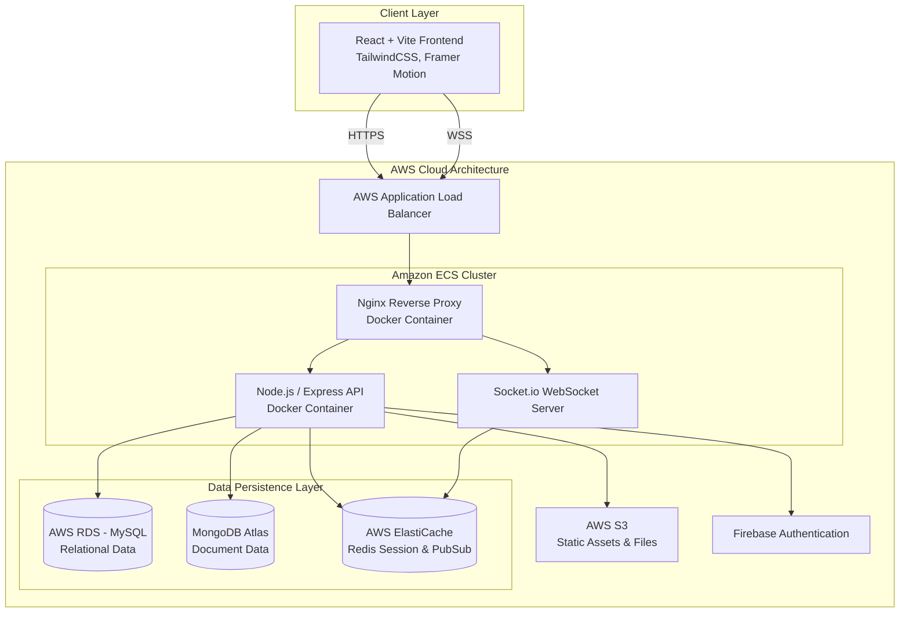
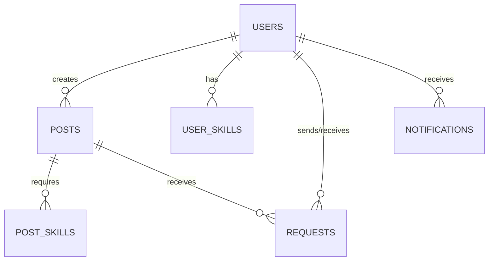

# TeamMates Finder - Enterprise Collaboration & Teammate Matching Platform

<p align="center">
  
</p>

## 1. High-Level Architecture Diagram



---

## 2. Executive Summary & Problem Statement

### **Problem Statement**
In modern tech environments, professionals and university students actively participate in hackathons, research projects, and competitive programming. However, discovering the right teammates with matching skills, verifiable availability, and complementary expertise is a highly fragmented and inefficient process relying on informal WhatsApp groups, Slack channels, or disjointed forums. 

### **The Solution**
**TeamMates Finder** is an enterprise-grade, highly scalable SaaS platform designed to seamlessly match technical talent. By leveraging robust database architectures and real-time socket communication, it allows users to dynamically search for skill sets, publish collaboration vacancies, manage incoming pitches, and instantly chat with accepted teammates.

---

## 3. Detailed Technology Stack & Rationale

This project utilizes a **hybrid polyglot persistence architecture**, combining the MERN stack with a robust MySQL relational layer.

### **Frontend**
*   **React 19 & Vite**: Ultra-fast hot-module replacement and optimized production bundling.
*   **Tailwind CSS v4 & Framer Motion**: Utility-first styling coupled with physics-based micro-animations for an OLED dark-themed, premium UI.
*   **Redux Toolkit**: Centralized, predictable state management for authentication tokens and user caching.

### **Backend**
*   **Node.js & Express.js**: Asynchronous, event-driven architecture perfectly suited for I/O heavy operations.
*   **Socket.io**: Enables bi-directional, real-time communication for typing indicators and instant messaging.

### **Database Strategy: Why MongoDB + MySQL?**
*   **MySQL (AWS RDS)**: Used as the **Primary Relational Database** (via Sequelize ORM). It strictly handles heavily structured data where ACID compliance, constraints, and complex joins are mandatory (e.g., Users, Posts, Skills mapping, Requests matrix).
*   **MongoDB (Atlas)**: Used as the **Secondary Document Database** (via Mongoose). Chosen specifically for unstructured, high-velocity telemetry data such as Chat Message Histories, Activity Logs, and JSON-heavy analytics that scale horizontally and do not require strict referential integrity.

### **DevOps & Infrastructure**
*   **Docker & Docker Compose**: Ensures identical environment parity across local development and production.
*   **AWS (ECS, ECR, RDS, S3)**: Enterprise-grade cloud hosting utilizing Fargate for serverless container execution.
*   **GitHub Actions**: Automated CI/CD pipelines for immutable deployments.

---

## 4. Key Features & User Roles

### **Role-Based Access Control (RBAC)**
1.  **Verified User (Participant)**: Can create posts, send pitches, and manage their own profile. Restricted strictly to valid domain emails.
2.  **Post Owner (Admin for Post)**: Can accept/reject incoming pitches, automatically close vacancies, and moderate their specific team.
3.  **System Administrator**: Has global privileges to moderate offensive content, ban users, and view platform telemetry.

### **Core Features**
*   **Dynamic Profile Building**: Add experiences, clubs, and tools natively managed via a centralized dashboard.
*   **Algorithmic Matching**: Smart post recommendations based on overlapping `Post_Skills` and `User_Skills`.
*   **Pitch & Request Matrix**: Submit highly customized application pitches to project creators. 
*   **Real-Time WebSockets Engine**: Instant, seamless communication with accepted partners featuring live typing indicators.
*   **ATS-Friendly Export**: Instantly export profiles and analytical data to PDF using native printing fallbacks.

---

## 5. Database Design

### **MySQL Schema (Relational & Transactional)**
Handles core entities requiring strict referential integrity.



*   **Users**: `user_id` (PK), `email` (Unique), `name`, `department`, `avg_rating`.
*   **Posts**: `post_id` (PK), `author_id` (FK), `title`, `type`, `vacancies`, `status`.
*   **Requests**: `request_id` (PK), `post_id` (FK), `sender_id` (FK), `receiver_id` (FK), `status`.
*   *(Note: Implements strict foreign key constraints, `ON DELETE CASCADE`, and database-level locking for concurrency control).*

### **MongoDB Schema (NoSQL / Document Store)**
Handles high-velocity, semi-structured data.

```json
// ChatMessage Document Model
{
  "_id": "ObjectId",
  "conversation_id": "String",
  "sender_id": "UUID (from MySQL)",
  "receiver_id": "UUID (from MySQL)",
  "content": "String",
  "attachments": ["URL_Strings"],
  "is_read": "Boolean",
  "timestamp": "ISODate"
}
```

---

## 6. Installation & Local Setup Guide

### Prerequisites
*   Node.js (v18+)
*   Docker & Docker Compose
*   MySQL Server (if not using Docker for DB)
*   Firebase Admin Credentials

### 1. Clone the Repository
```bash
git clone https://github.com/your-org/teammates-finder.git
cd teammates-finder
```

### 2. Environment Configuration
Create a `.env` file in the `/server` directory:
```env
PORT=5001
DB_NAME=teammates_db
DB_USER=root
DB_PASS=password
DB_HOST=mysql_db
MONGO_URI=mongodb+srv://<user>:<pass>@cluster.mongodb.net/
FIREBASE_PROJECT_ID=your-project-id
FIREBASE_CLIENT_EMAIL=your-client-email
FIREBASE_PRIVATE_KEY="your-private-key"
```

### 3. Running Locally (Without Docker)
```bash
# Terminal 1: Backend
cd server
npm install
npm run dev

# Terminal 2: Frontend
cd client
npm install
npm run dev
```

### 4. Running via Docker (Recommended)
This will spin up the Nginx proxy, Node.js API, and MySQL database automatically.
```bash
docker-compose up --build -d
```
Access the application at `http://localhost`.

---

## 7. DevOps & Deployment Pipeline

This project employs a zero-downtime, fully automated CI/CD pipeline using **GitHub Actions**.

### **Pipeline Workflow**
1.  **Code Commit**: Developer pushes code to the `main` branch.
2.  **CI Validation**: GitHub Actions spins up an Ubuntu runner, runs `npm install`, executes ESLint, and runs integration tests.
3.  **Container Build**: 
    *   The React frontend is built and injected into a lightweight `nginx:alpine` image.
    *   The Node.js backend is containerized.
4.  **AWS ECR Push**: Docker images are securely pushed to Amazon Elastic Container Registry (ECR).
5.  **AWS ECS Deployment**: 
    *   Amazon Elastic Container Service (ECS) running on **AWS Fargate** (serverless compute) pulls the latest images.
    *   The **Application Load Balancer (ALB)** routes traffic seamlessly to the new containers, draining the old ones to ensure zero downtime.

### **Infrastructure Snapshot**
*   **Static Assets**: Hosted on **Amazon S3** and distributed via **CloudFront CDN**.
*   **Database**: **Amazon RDS (MySQL)** configured with Multi-AZ for failover redundancy.

---

## 8. API Documentation

RESTful API architecture with standard HTTP methods and status codes.

### **1. Get User Profile**
*   **Endpoint**: `GET /api/users/profile`
*   **Headers**: `Authorization: Bearer <Firebase_ID_Token>`
*   **Response (200 OK)**:
    ```json
    {
      "user_id": "uuid-string",
      "name": "Jane Doe",
      "email": "jd1234@gmail.com",
      "experiences": [ ... ],
      "skills": [ ... ]
    }
    ```

### **2. Send Collaboration Pitch**
*   **Endpoint**: `POST /api/requests/send/:postId`
*   **Headers**: `Authorization: Bearer <Firebase_ID_Token>`
*   **Body**: 
    ```json
    { "pitch_message": "I have extensive experience in React." }
    ```
*   **Response (201 Created)**: Returns the generated Request payload.

---

## 9. Security & Performance Optimization

### **Security Implementations**
1.  **Authentication**: Stateless authentication using Firebase Identity Toolkit. Tokens are verified via `firebase-admin` middleware on every protected route.
2.  **Domain Restriction**: Custom backend middleware intercepts logins and strictly rejects non-verified domains.
3.  **CORS & COOP**: Strict `Cross-Origin-Opener-Policy` headers configured in Nginx to prevent cross-site leakage during OAuth popups.
4.  **SQL Injection Prevention**: Using Sequelize ORM parameterized queries to completely neutralize SQL injection vectors.

### **Performance Enhancements**
*   **Vite Proxy & Build**: Tree-shaking and minification for sub-second frontend loads.
*   **Nginx Caching**: Serving static React builds directly from memory while proxying dynamic `/api` and `/socket.io` requests upstream.
*   **Database Indexes**: B-Tree indexes applied to foreign keys (`author_id`, `receiver_id`) to speed up relational joins.

---

## 10. Folder Structure Overview

```text
TeamMates Finder/
├── client/                     # React Frontend
│   ├── src/
│   │   ├── components/         # Reusable UI (Cards, Modals)
│   │   ├── pages/              # Route-level views (Profile, Dashboard)
│   │   ├── redux/              # State management slices
│   │   ├── services/           # Axios interceptors, Socket instance
│   │   └── index.css           # Tailwind injection & print media queries
│   ├── Dockerfile              # Multi-stage Nginx build
│   └── vite.config.js          # Build configuration & proxy
├── server/                     # Node.js Backend
│   ├── config/                 # Firebase & DB configuration
│   ├── controllers/            # Core business logic
│   ├── models/                 # Sequelize MySQL Schemas
│   ├── routes/                 # Express API endpoints
│   ├── services/               # Socket.io Notification Engine
│   └── Dockerfile              # Node.js environment build
├── nginx/                      # Reverse Proxy Configuration
│   └── nginx.conf              # Upstream routing rules
├── docker-compose.yml          # Container orchestration
└── .github/workflows/          # CI/CD Pipeline definitions
```

---

## 11. Future Enhancements & Contributing

### **Roadmap**
*   [ ] **Redis Caching**: Implement AWS ElastiCache to store high-frequency read queries (like the Global Feed) to reduce RDS load.
*   [ ] **Kafka Message Queue**: Decouple the real-time notification engine using Apache Kafka for extreme scalability during major launch events.
*   [ ] **Algorithmic Matchmaking AI**: Integrate a small Python/FastAPI microservice to run Cosine Similarity algorithms on user skills to automate partner recommendations.

### **Contributing**
1. Fork the Project.
2. Create your Feature Branch (`git checkout -b feature/AmazingFeature`).
3. Commit your Changes (`git commit -m 'Add some AmazingFeature'`).
4. Push to the Branch (`git push origin feature/AmazingFeature`).
5. Open a Pull Request.

---
*Architected and developed with ❤️ for the global developer community.*
